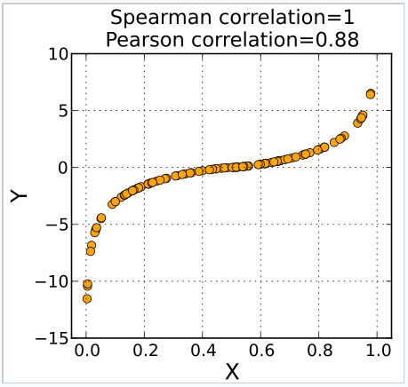
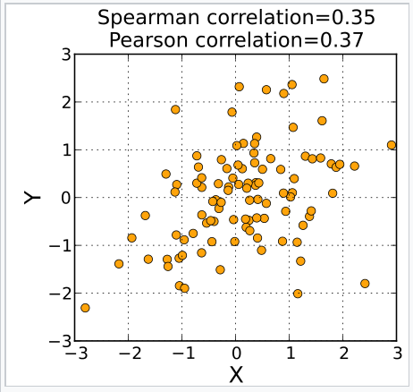
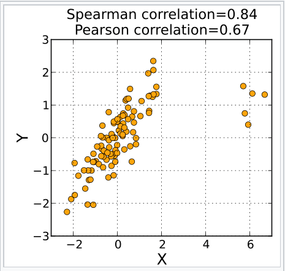

```{r setup, include=FALSE}
knitr::opts_chunk$set(collapse = TRUE)
```

# 순서형 변수 Ordinal Variable
### 부제: 설문조사법을 실시한다면 어떻게 분석해야 할까?

 주변에 사회과학을 하는 친구들을 보면, 연구계획을 짤 때 많은 경우 설문지를 활용하는 모습을 심심찮게 볼 수 있다. 실제로 사회학과에서는 한 학기동안 설문지법을 배우고 직접 제작하는 실습과정을 겪는다고 한다. 그런데 다지선다형 설문지법은 생각보다 분석이 까다로울 것으로 생각된다. 왜냐하면 변수의 종류도 일반 명목형 변수만 있는 것이 아니라 순서형 변수도 있고, 또 숫자형 변수까지 섞여있을 수 있기 때문이다. 그렇다면 이러한 경우에는 도대체 어떻게 분석해야 할지 궁금하였다. 그중에서도 특히, 명목형도 아닌 것이 숫자형도 아닌 순서형 변수를 중심으로 다각도에서 조사하여 알아보았다. 

### 1. Spearman 상관계수: 순서형 변수를 위한 상관계수
 첫번째로는, 상관계수에 대해 알아보았다. 일반적으로 설문지법에서는 1점~5점과 같은 형식으로 데이터가 수집되기 때문에 순서형처럼 Pearson 상관계수를 써서 분석하기도 한다. 하지만 엄밀히 말하자면, 순서형 변수는 scoring이 큰 의미가 없다면, 숫자 그 자체가 아니라 ‘순서’에 대한 정보만을 가지고 있는 것이다. 그렇기 때문에 의문이 들었던 것 중 하나는 Pearson correlation을 그대로 써도 될지 여부이다.
 실제로 이러한 의문점을 해소하기 위해, Spearman 상관계수가 있다. (이외에도 Tau 상관계수도 있다고 하지만, 둘 다 비모수적 접근법이기 때문에 큰 차이가 없다고 알려져 있다.) 이것이 일반 Pearson 상관계수와 다른 점은, scoring의 영향이 없다는 점이다. 왜냐하면 X_i,Y_i가 rg_{X_i},rg_{Y_i}로 변환되어 scoring에 따른 편차를 없애기 위해 각 변수들을 rank화하는 과정이 들어간 후 상관계수가 계산되기 때문이다. 예를 들어, 학점 A, B, C, D를 각각 10,3,2,1로 점수를 주던, 4,3,2,1로 점수를 주던 상관이 없게끔 Spearman 상관계수는 계산한다. 공식은 아래와 같다.

$$
r_s=\rho_{rg_X,rg_Y}=\frac{cov\left(rg_X,rg_Y\right)}{\sigma_{rg_X}\times\sigma_{rg_Y}}
$$

구체적인 선형관계를 보지 않고 단조함수인지 여부를 판단하는 것과 같은데, 실제 상황에서Pearson 상관계수와 어떻게 다른지는 아래의 사진을 통해서 최종적으로 이해하면 깔끔할 것이다.





### 2. Likert scale: 중간응답경향을 고려하라
 두 번째로는, Scoring과 관련된 부분이다. 사실 이 부분은 통계학적인 지식보다는 인간 그 자체를 이해하고자 하는 심리학의 영역일 수 있다. 특정 영역에 대한 만족도 수준을 조사하고자 할 때면, ‘매우 만족 - 매우 불만족’으로 측정하게 되며, 일반적으로 Likert 5점 또는 7점 척도를 사용한다. 이때, 등급형 질문문항에 대한 응답경향 연구(통계청)에 따르면, 사람들은 극단적인 답변을 내놓기를 꺼려함과 동시에 중간응답을 선호하는 경향성이 있다. 그렇기 때문에 1점(매우 불만족) 또는 7점(매우 만족)를 선택하기보다는 2점이나 6점을 선택하며, 때로는 중간점수인 4를 채택하기도 한다. 그렇기 때문에 우리는 설문지법을 통해 얻은 데이터를 분석할 때, 1점과 7점을 선택한 사람들이 극단적으로 적은지 EDA를 통해 확인해보고, 만약 그러하다면 6점과 7점(또는 1점과 2점)에 응답한 사람들을 합쳐서 계산하는 등과 같은 추가적인 전처리가 필요할 것이다.
 정리하자면, scoring에 대해서만 고려하는 것은 실험자의 입장만을 생각한 것이다. 추가적으로 설문참가자들이 극단적인 값을 피하고자 하는 심리에 대해서도 고려해주어야 보다 더 완벽한 사회연구라고 할 수 있다.
 *참고자료: 등급형 질문문항에 대한 응답경향 연구(통계청) 
